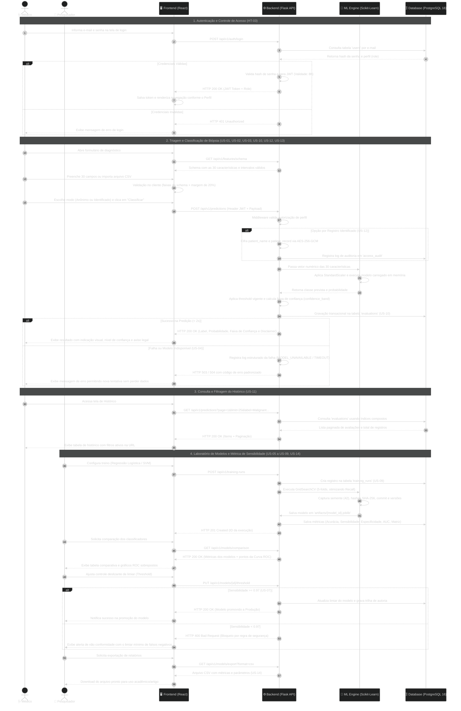

```mermaid
%%{init: {'theme': 'dark'}}%%

sequenceDiagram
    autonumber
    actor Medico as 🩺 Médico
    actor Pesquisador as 🔬 Pesquisador
    participant FE as 🖥️ Frontend (React)
    participant BE as ⚙️ Backend (Flask API)
    participant ML as 🧠 ML Engine (Scikit-Learn)
    participant DB as 🗄️ Database (PostgreSQL 16)

    %% -----------------------------------------------------------------
    %% FLUXO 1: AUTENTICAÇÃO E CONTROLE DE ACESSO (HT-03)
    %% -----------------------------------------------------------------
    Note over Medico, DB: 1. Autenticação e Controle de Acesso (HT-03)
    Medico->>FE: Informa e-mail e senha na tela de login
    FE->>BE: POST /api/v1/auth/login
    BE->>DB: Consulta tabela 'users' por e-mail
    DB-->>BE: Retorna hash da senha e perfil (role)
    alt Credenciais Válidas
        BE->>BE: Valida hash de senha e gera JWT (Validade: 8h)
        BE-->>FE: HTTP 200 OK (JWT Token + Role)
        FE->>FE: Salva token e renderiza navegação conforme o Perfil
    else Credenciais Inválidas
        BE-->>FE: HTTP 401 Unauthorized
        FE-->>Medico: Exibe mensagem de erro de login
    end

    %% -----------------------------------------------------------------
    %% FLUXO 2: AVALIAÇÃO E PREDIÇÃO DE BIÓPSIA (US-01 a US-04, US-10, US-12, US-13)
    %% -----------------------------------------------------------------
    Note over Medico, DB: 2. Triagem e Classificação de Biópsia (US-01, US-02, US-03, US-10, US-12, US-13)
    Medico->>FE: Abre formulário de diagnóstico
    FE->>BE: GET /api/v1/features/schema
    BE-->>FE: Schema com as 30 características e intervalos válidos
    
    Medico->>FE: Preenche 30 campos ou importa arquivo CSV
    FE->>FE: Validação no cliente (faixas do schema + margem de 20%)
    Medico->>FE: Escolhe modo (Anônimo ou Identificado) e clica em "Classificar"
    
    FE->>BE: POST /api/v1/predictions (Header JWT + Payload)
    BE->>BE: Middleware valida autorização de perfil
    
    alt Opção por Registro Identificado (US-12)
        BE->>BE: Cifra patient_name e patient_record via AES-256-GCM
        BE->>DB: Registra log de auditoria em 'access_audit'
    end
    
    BE->>ML: Passa vetor numérico das 30 características
    ML->>ML: Aplica StandardScaler e executa modelo carregado em memória
    ML-->>BE: Retorna classe prevista e probabilidade
    
    BE->>BE: Aplica threshold vigente e calcula faixa de confiança (confidence_band)
    BE->>DB: Gravação transacional na tabela 'evaluations' (US-10)
    
    alt Sucesso na Predição (< 2s)
        BE-->>FE: HTTP 200 OK (Label, Probabilidade, Faixa de Confiança e Disclaimer)
        FE-->>Medico: Exibe resultado com indicação visual, nível de confiança e aviso legal
    else Falha ou Modelo Indisponível (US-04)
        BE->>BE: Registra log estruturado da falha (MODEL_UNAVAILABLE / TIMEOUT)
        BE-->>FE: HTTP 503 / 504 com código de erro padronizado
        FE-->>Medico: Exibe mensagem de erro permitindo nova tentativa sem perder dados
    end

    %% -----------------------------------------------------------------
    %% FLUXO 3: CONSULTA AO HISTÓRICO DE AVALIAÇÕES (US-11)
    %% -----------------------------------------------------------------
    Note over Medico, DB: 3. Consulta e Filtragem do Histórico (US-11)
    Medico->>FE: Acessa tela de Histórico
    FE->>BE: GET /api/v1/predictions?page=1&limit=25&label=Malignant...
    BE->>DB: Consulta 'evaluations' usando índices compostos
    DB-->>BE: Lista paginada de avaliações e total de registros
    BE-->>FE: HTTP 200 OK (Items + Paginação)
    FE-->>Medico: Exibe tabela de histórico com filtros ativos na URL

    %% -----------------------------------------------------------------
    %% FLUXO 4: TREINAMENTO, COMPARAÇÃO E PROMOÇÃO DE MODELOS (US-05 a US-09, US-14)
    %% -----------------------------------------------------------------
    Note over Pesquisador, DB: 4. Laboratório de Modelos e Métrica de Sensibilidade (US-05 a US-09, US-14)
    Pesquisador->>FE: Configura treino (Regressão Logística / SVM)
    FE->>BE: POST /api/v1/training-runs
    BE->>DB: Cria registro na tabela 'training_runs' (US-09)
    
    BE->>ML: Executa GridSearchCV (5-folds, otimizando Recall)
    ML->>ML: Captura semente (42), hashes SHA-256, commit e versões
    ML->>BE: Salva modelo em 'artifacts/{model_id}.joblib'
    
    BE->>DB: Salva métricas (Acurácia, Sensibilidade, Especificidade, AUC, Matriz)
    BE-->>FE: HTTP 201 Created (ID da execução)
    
    Pesquisador->>FE: Solicita comparação dos classificadores
    FE->>BE: GET /api/v1/models/comparison
    BE-->>FE: HTTP 200 OK (Métricas dos modelos + pontos da Curva ROC)
    FE-->>Pesquisador: Exibe tabela comparativa e gráficos ROC sobrepostos
    
    Pesquisador->>FE: Ajusta controle deslizante de limiar (Threshold)
    FE->>BE: PUT /api/v1/models/{id}/threshold
    
    alt Sensibilidade >= 0.97 (US-07)
        BE->>DB: Atualiza limiar do modelo e grava trilha de autoria
        BE-->>FE: HTTP 200 OK (Modelo promovido a Produção)
        FE-->>Pesquisador: Notifica sucesso na promoção do modelo
    else Sensibilidade < 0.97
        BE-->>FE: HTTP 400 Bad Request (Bloqueio por regra de segurança)
        FE-->>Pesquisador: Exibe alerta de não conformidade com o limiar mínimo de falsos negativos
    end

    Pesquisador->>FE: Solicita exportação de relatórios
    FE->>BE: GET /api/v1/models/export?format=csv
    BE-->>FE: Arquivo CSV com métricas e parâmetros (US-14)
    FE-->>Pesquisador: Download do arquivo pronto para uso acadêmico/artigo
```
