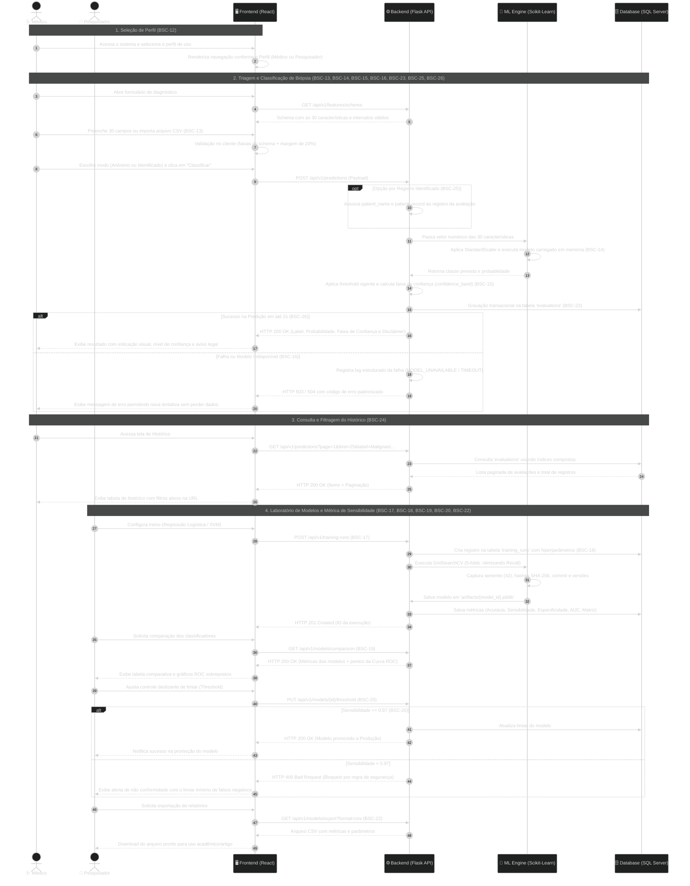

```mermaid
%%{init: {'theme': 'dark'}}%%

sequenceDiagram
    autonumber
    actor Medico as 🩺 Médico
    actor Pesquisador as 🔬 Pesquisador
    participant FE as 🖥️ Frontend (React)
    participant BE as ⚙️ Backend (Flask API)
    participant ML as 🧠 ML Engine (Scikit-Learn)
    participant DB as 🗄️ Database (SQL Server)

    %% -----------------------------------------------------------------
    %% FLUXO 1: SELEÇÃO DE PERFIL (BSC-12)
    %% -----------------------------------------------------------------
    Note over Medico, FE: 1. Seleção de Perfil (BSC-12)
    Medico->>FE: Acessa o sistema e seleciona o perfil de uso
    FE->>FE: Renderiza navegação conforme o Perfil (Médico ou Pesquisador)

    %% -----------------------------------------------------------------
    %% FLUXO 2: AVALIAÇÃO E PREDIÇÃO DE BIÓPSIA (BSC-13 a BSC-16, BSC-23, BSC-25, BSC-26)
    %% -----------------------------------------------------------------
    Note over Medico, DB: 2. Triagem e Classificação de Biópsia (BSC-13, BSC-14, BSC-15, BSC-16, BSC-23, BSC-25, BSC-26)
    Medico->>FE: Abre formulário de diagnóstico
    FE->>BE: GET /api/v1/features/schema
    BE-->>FE: Schema com as 30 características e intervalos válidos
    
    Medico->>FE: Preenche 30 campos ou importa arquivo CSV (BSC-13)
    FE->>FE: Validação no cliente (faixas do schema + margem de 20%)
    Medico->>FE: Escolhe modo (Anônimo ou Identificado) e clica em "Classificar"
    
    FE->>BE: POST /api/v1/predictions (Payload)
    
    opt Opção por Registro Identificado (BSC-25)
        BE->>BE: Associa patient_name e patient_record ao registro da avaliação
    end
    
    BE->>ML: Passa vetor numérico das 30 características
    ML->>ML: Aplica StandardScaler e executa modelo carregado em memória (BSC-14)
    ML-->>BE: Retorna classe prevista e probabilidade
    
    BE->>BE: Aplica threshold vigente e calcula faixa de confiança (confidence_band) (BSC-15)
    BE->>DB: Gravação transacional na tabela 'evaluations' (BSC-23)
    
    alt Sucesso na Predição em até 2s (BSC-26)
        BE-->>FE: HTTP 200 OK (Label, Probabilidade, Faixa de Confiança e Disclaimer)
        FE-->>Medico: Exibe resultado com indicação visual, nível de confiança e aviso legal
    else Falha ou Modelo Indisponível (BSC-16)
        BE->>BE: Registra log estruturado da falha (MODEL_UNAVAILABLE / TIMEOUT)
        BE-->>FE: HTTP 503 / 504 com código de erro padronizado
        FE-->>Medico: Exibe mensagem de erro permitindo nova tentativa sem perder dados
    end

    %% -----------------------------------------------------------------
    %% FLUXO 3: CONSULTA AO HISTÓRICO DE AVALIAÇÕES (BSC-24)
    %% -----------------------------------------------------------------
    Note over Medico, DB: 3. Consulta e Filtragem do Histórico (BSC-24)
    Medico->>FE: Acessa tela de Histórico
    FE->>BE: GET /api/v1/predictions?page=1&limit=25&label=Malignant...
    BE->>DB: Consulta 'evaluations' usando índices compostos
    DB-->>BE: Lista paginada de avaliações e total de registros
    BE-->>FE: HTTP 200 OK (Items + Paginação)
    FE-->>Medico: Exibe tabela de histórico com filtros ativos na URL

    %% -----------------------------------------------------------------
    %% FLUXO 4: TREINAMENTO, COMPARAÇÃO E PROMOÇÃO DE MODELOS (BSC-17 a BSC-22)
    %% -----------------------------------------------------------------
    Note over Pesquisador, DB: 4. Laboratório de Modelos e Métrica de Sensibilidade (BSC-17, BSC-18, BSC-19, BSC-20, BSC-22)
    Pesquisador->>FE: Configura treino (Regressão Logística / SVM)
    FE->>BE: POST /api/v1/training-runs (BSC-17)
    BE->>DB: Cria registro na tabela 'training_runs' com hiperparâmetros (BSC-18)
    
    BE->>ML: Executa GridSearchCV (5-folds, otimizando Recall)
    ML->>ML: Captura semente (42), hashes SHA-256, commit e versões
    ML->>BE: Salva modelo em 'artifacts/{model_id}.joblib'
    
    BE->>DB: Salva métricas (Acurácia, Sensibilidade, Especificidade, AUC, Matriz)
    BE-->>FE: HTTP 201 Created (ID da execução)
    
    Pesquisador->>FE: Solicita comparação dos classificadores
    FE->>BE: GET /api/v1/models/comparison (BSC-19)
    BE-->>FE: HTTP 200 OK (Métricas dos modelos + pontos da Curva ROC)
    FE-->>Pesquisador: Exibe tabela comparativa e gráficos ROC sobrepostos
    
    Pesquisador->>FE: Ajusta controle deslizante de limiar (Threshold)
    FE->>BE: PUT /api/v1/models/{id}/threshold (BSC-20)
    
    alt Sensibilidade >= 0.97 (BSC-20)
        BE->>DB: Atualiza limiar do modelo
        BE-->>FE: HTTP 200 OK (Modelo promovido a Produção)
        FE-->>Pesquisador: Notifica sucesso na promoção do modelo
    else Sensibilidade < 0.97
        BE-->>FE: HTTP 400 Bad Request (Bloqueio por regra de segurança)
        FE-->>Pesquisador: Exibe alerta de não conformidade com o limiar mínimo de falsos negativos
    end

    Pesquisador->>FE: Solicita exportação de relatórios
    FE->>BE: GET /api/v1/models/export?format=csv (BSC-22)
    BE-->>FE: Arquivo CSV com métricas e parâmetros
    FE-->>Pesquisador: Download do arquivo pronto para uso acadêmico/artigo
```
